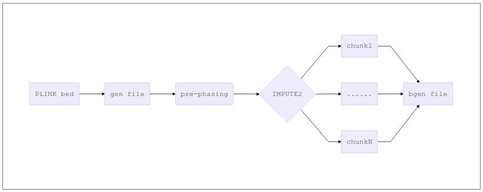

# GWAS-pipeline

## Description

This is a suit of GWAS workflows for [CHIMGEN]([http://chimgen.tmu.edu.cn](http://chimgen.tmu.edu.cn/)) project built on [NEXTFLOW](<https://www.nextflow.io/>) framework.

## Contents

- [Getting started](#4)

- [QC of raw data](#1)

- [Imputation](#2)

- [Association analysis](#3)

## <a name="4"></a>Getting started

I built the whole pipeline on [NEXTFLOW](<https://www.nextflow.io/>) framework. And NEXTFLOW can be installed by conda. To get started, you should clone this repo firstly.

```shell
git clone https://github.com/Jianhua-Wang/GWAS-pipeline.git
```

then set up the conda environment:

```shell
# create conda environment
cd bin
conda env create -f gwascondaenv.yml

# download qctool which is too big to upload to GitHub
wget -c https://www.well.ox.ac.uk/~gav/resources/qctool_v2.0.1-Ubuntu14.04-x86_64.tgz
tar -zxvf qctool_v2.0.1-Ubuntu14.04-x86_64.tgz
mv ./qctool_v2.0.1-Ubuntu14.04-x86_64/qctool ./
rm -rf qctool_v2.0.1-Ubuntu14.04-x86_64*
```

and use the commands below to activate/deactivate the environment:

```shell
conda activate gwas
conda deactivate
```

This usage of this pipeline is quite simple, for example:

```shell
nextflow run qc.nf -c qc.config
```

`qc.nf` is the NEXTFLOW script for GWAS quality control and `qc.config` is the configuration file that stores the parameters of the pipeline. NEXTFLOW will genere a `work` folder in work directory for debuging and storing intermediate files. You can remove the Intermediate files by manually or using `nextflow clean -f`.

---

## <a name="1"></a>QC of raw data

### Purpose

This is a pipeline of genotype data quality assessment and control, including variant-level QC and individual-level QC. These steps are critical for the following imputation and association analysis, could reduce the false positive of GWAS results.

I referred to the *Nature Protocols* from [Anderson et al.](<https://www.nature.com/articles/nprot.2010.116>) and a NEXTFLOW workflow from [H3ABioNet](<https://github.com/h3abionet/h3agwas>). I didn't describe the details of every step in this tutorial, but it's very easy to understand the principles on the *Nature Protocols*.

### Input

PLINK binary .bed, .bim, and .fam file (10 sample)

There are various types of genotype formats, such as PLINK bed, gen, vcf, bgen, even pgen. You can find the description of them on [PLINK's website](https://www.cog-genomics.org/plink/1.9/formats). In this part, we mainly use PLINK bed format, which contains a [bed](https://www.cog-genomics.org/plink/1.9/formats#bed) file for genotype, a [bim](https://www.cog-genomics.org/plink/1.9/formats#bim) file for variant information, and a [fam](https://www.cog-genomics.org/plink/1.9/formats#fam) file for individual information, with the same prefix.

### Output

This pipeline does not only output the clean data but also generate tables of filtered variants and individuals and figures of data assessment. I put the tables and figures in a HTML report to read easily.

| Output file              | Description                                       |
| ------------------------ | ------------------------------------------------- |
| test-nd-c-c.bim          | bim file of clean data                            |
| test-nd-c-c.bed          | bed file of clean data                            |
| test-nd-c-c.fam          | fam file of clean data                            |
| test.dups                | duplicated variants                               |
| test.badsex              | sample with ambiguous sex                         |
| test-nd-c.irem           | removed sample due to missing rate                |
| test-nd-fail_IBD.txt     | related sample                                    |
| test-nd-c-fail_het.txt   | sample with extreme high or low heterozygous rate |
| test-nd-c-c.irem         | sample removed in phased 3                        |
| test-GWAS-QC_report.html | report of QC                                      |
| test_runtime.html        | report of workflow running                        |
| test_timeline.html       | report of workflow running                        |

### Usage

To run GWAS QC pipeline on the test data in `input` folder, just activate conda environment and use:

```shell
conda activate gwas
nextflow run qc.nf -c qc.config
```

One can adjust the parameters such as prefix of input PLINK file, path of output file, and the cutoff of MAF modifying the `qc.config` file:

```
params {

    work_dir = "/$PWD"
    input_dir = "${params.work_dir}/input"
    output_dir = "${params.work_dir}/output/qc"
    input_pat = "test"

    pca_ref_dir = "./pca_ref/"
    pca_ref_pat = "hapmap3_pca"

    cut_maf = 0.0001
    cut_mind = 0.03
    cut_geno = 0.05
    cut_hwe = 0.00001
    pi_hat = 0.1875
    f_lo_male = 0.8
    f_hi_female = 0.2
    times_of_meanhet = 3
}
```

or use the command line directly, like:

```shell
nextflow run qc.nf -c qc.config --output_dir qc1 --cut_maf 0.01
```

This command changed the path of output file. You can find a new folder named `qc1` was created in `output` folder and the clean data is with MAF >= 0.01.

:star: The `bin` folder is the default environmental variable of NEXTFLOW, so I just put the stable version of used tools in `bin` folder instead of using a script to set up.

The stdout of NEXTFLOW looks like:

```shell
(gwas) ➜  GWAS-pipeline git:(master) ✗ nextflow run qc.nf -c qc.config           
N E X T F L O W  ~  version 0.30.1
Launching `qc.nf` [elated_easley] - revision: 16c33dbc96
[warm up] executor > local
[38/981164] Submitted process > identifyIndivDiscSexinfo (1)
[ea/0f8c22] Submitted process > getDuplicateMarkers (1)
[21/126daf] Submitted process > showHWEStats (1)
[f9/69193c] Submitted process > removeDuplicateSNPs (1)
[aa/ce6083] Submitted process > getInitMAF (1)
[2a/0c7329] Submitted process > removeQCPhase1 (1)
[99/6104a7] Submitted process > generateIndivMissingnessPlot (1)
[bb/9f881b] Submitted process > generateSnpMissingnessPlot (1)
[fe/33324b] Submitted process > showInitMAF (1)
[ff/38d030] Submitted process > calculateSampleHeterozygosity (1)
[a7/f6167b] Submitted process > pruneForIBD (1)
[12/a1cd0a] Submitted process > compPCA (1)
[b0/4c675a] Submitted process > getBadIndivsMissingHet (1)
[b7/c9ea9e] Submitted process > generateMissHetPlot (1)
[fa/1ef8f2] Submitted process > findRelatedIndiv (1)
[ee/217c0c] Submitted process > removeQCIndivs (1)
[56/6f17db] Submitted process > drawPCA (1)
[c5/ab2f2d] Submitted process > calculateMaf (1)
[7f/307d0a] Submitted process > generateHwePlot (1)
[2b/7eb74b] Submitted process > generateMafPlot (1)
[b3/fdb024] Submitted process > produceReports (1)
The output report is called //f/jianhua/jianhua_pipeline/GWAS-pipeline/output/qc/test-GWAS-QC_report.html
```

### Main steps

There are 21 steps in this QC pipeline and I wrote them in NEXTFLOW and lots of Python scripts, so it's not possible to explain each step clearly here. To understand the details in the pipeline, you need to be proficient in PLINK, NEXTFLOW and Python.

Here I use a simple example to demonstrate how the NEXTFLOW works.

```
process calculateMaf {
    input:
        file(plinks) from qc3A_ch

    output:
        file "${base}.frq" into maf_plot_ch
        file "${base}.hwe" into hwe_scores_ch

    script:
        base = plinks[0].baseName
        out  = base.replace(".","_")
        """
        plink --bfile $base --hardy --freq --out $out
        """
}
```

In NEXTFLOW, a single step is defined as a `process`. Every `process` has three sections: input, output, and script. The input file of every step is loaded in input section and the output file are pull out to other channels using wildcard. In script section, I used `--hardy` and `--freq` to calculate the HWE and MAF.

---

## <a name="2"></a>Imputation

### Purpose

Genotype imputation is a statistical technique that is often used to increase the power and resolution of genetic association studies. Imputation methods work by using haplotype patterns in a reference panel, such as the 1000 Genomes Project (1000G) to predict unobserved genotypes in a study dataset.

### Reference

I used the reference panel constructed by IMPUTE2. You can download the files using:

```shell
cd impute_ref
bash 01_prepare_reference.sh
```

### Input

The input files of imputation are the output files of QC pipeline which are PLINK bed format.

### Output

The original output of IMPUTE2 is .gen format which is readable and takes up lots of space. So I convert the .gen format to the .bgen format which is far small then .gen format and very fast to read using [qctool](<https://www.well.ox.ac.uk/~gav/qctool_v2/index.html>).

```shell
(gwas) ➜  imputation git:(master) ✗ ll
total 180M
-rw-rw-r-- 2 jianhua jianhua 177M 9月   2 19:56 test-nd-c-c.bgen
-rw-rw-r-- 1 jianhua jianhua 2.9M 9月   2 19:56 test-nd-c-c_runtime.html
-rw-rw-r-- 1 jianhua jianhua  15K 9月   2 19:56 test-nd-c-c_timeline.html
```

### Usage

Same as the usage of QC pipeline, it's very easy to run this pipeline:

```shell
nextflow run impute_with_onephased_prephasing.nf -c impute_with_onephased_prephasing.config
```

the parameters in configuration file are most fixed parameters:

```
params {

    work_dir = "/$PWD" 
    output_dir = "${params.work_dir}/output/imputation"

    input_dir = "${params.work_dir}/input"
    input_pat = "test"
    
    chromosomes_List = [21,22]
    chromosomeSizesFile = "./hg19_chromosomes_size/hg19_chromosomes_size.txt"

    map_dir = "./impute_ref/1000GP_Phase3/"
    map_pattern = "genetic_map_chr%s_combined_b37.txt"

    ref_panel_dir = "./impute_ref/1000GP_Phase3/"
    ref_hap_pattern = "1000GP_Phase3_chr%s.hap.gz"
    ref_leg_pattern = "1000GP_Phase3_chr%s.legend.gz"
    ref_sample = "1000GP_Phase3.sample"

    maxForks_shapeit = 10
    maxForks_impute2 = 20

}
```

In the test example, I only imputed chr21 and chr22. You can replace [21,22] with 1..22 for autosomes imputation.

:boom: I split file in every 5Mb bin for parallel running. You will get a error if there is no variant in this bin when using IMPUTE2. In order to ensure success, I have ignored such errors, the stdout looks like:

```shell
[1e/a15433] NOTE: Missing output file(s) `chr21-5000001-10000000.imputed` expected by process `impute2 (2)` -- Error is ignored
[e8/0b9125] NOTE: Missing output file(s) `chr21-10000001-15000000.imputed` expected by process `impute2 (3)` -- Error is ignored
[0d/448b04] NOTE: Missing output file(s) `chr22-50000001-51304566.imputed` expected by process `impute2 (21)` -- Error is ignored
```

### Main steps



As the graph shows, I split the input plink format into .gen by chromosomes, then impute under every 5,000,000 BP bin and merge the results of chromosomes, finally, convert the gen format files into bgen format.

This parallel strategy is easy to implement in NEXTFLOW, however, imputation will produce many large files.

## <a name="2"></a>Association analysis

### Purpose

As for association test, we reviewed lots of GWAS quantitative traits and summarize the association model they used. The most used and the earliest is generalized linear model, which is applied in PLINK and hail. Hail is a python module developed by Board institute. Different with GLM, mixed linear model involves the concept of random effect which is in estimated by genetic relationship matrix. And GCTA is one of the representative tools.  As the imputation becoming mainstream, many GWAS use SNPTEST which was also developed by Marchini. It's based on a missing data likelihood theory, fully accounting for the uncertainty in genotypes.

### Input

1. results of imputation (bgen format)
2. information of sample: ID, phenotypes, covariates (sample format)

```shell
cat test-nd-c-c.sample 
ID_1 ID_2 missing tiv age height sex
0 0 0 P C C D
1 1 0 1 21 170 1
2 2 0 2 22 171 2
3 3 0 3 23 172 1
4 4 0 4 24 173 2
5 5 0 5 25 174 2
6 6 0 6 26 175 1
7 7 0 7 27 176 1
8 8 0 8 28 177 2
9 9 0 9 29 178 1
10 10 0 10 30 179 2
```

Above is the sample file I used in the example. This format has a two-line head and the first three are always ID_1, ID_2 and missing. Column `missing` is missing rate of every individual and I fill it with zero because SNPTEST will calculate by itself instead of using this column. `tiv` is the interested phenotype while the second line is "P" for "Phenotype". And I used age, height, and sex as covariates. In second head, continuous covariates are represented by 'C' while discrete covariates are represented by 'D'.

### Output

Summary statistics and a PDF file with Manhattan plot and qq plot.

### Usage

```shell
conda activate gwas
nextflow run snptest_frequentist.nf -c snptest_frequentist.config
conda deactivate
```

---

## Caution

- In PCA of QC section, I used hapmap3 as the background. So the PCA is based on the overlapped variants between hapmap3 and input data. Sometimes it will report an error if the overlapped variants has inconsistent alleles, so make sure your variants are all forward strand, which is also important in imputation.
- In imputation section, I only imputed the variants in autosomes because the association analysis of chrX is complicated, although imputation on chrX is possible.
- You will got nothing on the manhattan plot and qq plot, and the P-value in results are all NA, cause SNPTEST requires at least 100 sample but we only have 10 in the test data. You will see the correct results with true data.

## Reference

1. Anderson, C. A., Pettersson, F. H., Clarke, G. M., Cardon, L. R., Morris, A. P., & Zondervan, K. T. (2010). Data quality control in genetic case-control association studies. *Nature Protocols*, *5*(9), 1564–1573. https://doi.org/10.1038/nprot.2010.116
2. Van Leeuwen, E. M., Kanterakis, A., Deelen, P., Kattenberg, M. V., Slagboom, P. E., De Bakker, P. I. W., … Hottenga, J. J. (2015). Population-specific genotype imputations using minimac or IMPUTE2. *Nature Protocols*, *10*(9), 1285–1296. https://doi.org/10.1038/nprot.2015.077
3. Clarke, G. M., Anderson, C. A., Pettersson, F. H., Cardon, L. R., Morris, A. P., & Zondervan, K. T. (2011). Basic statistical analysis in genetic case-control studies. *Nature Protocols*, *6*(2), 121–133. https://doi.org/10.1038/nprot.2010.182